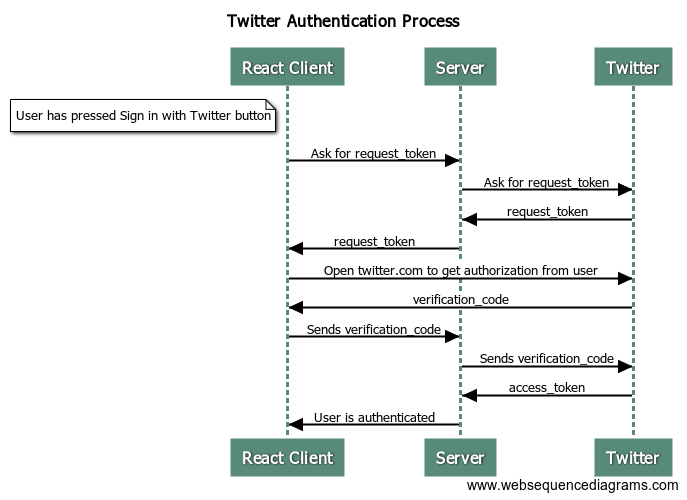

### how tf does privateRoutes work; like wtf is ...rest

## Netlify docs for deployment

- https://docs.netlify.com/configure-builds/environment-variables/

## Debug Netlify build

changed build process

You know you can just conditionally render routes. Securing the routes is only a courtesy to the user though(preventing error messages), the work being done behind the routes needs to be secured as well

<switch> 
{false && <route path="/secure*"/>}
<route path="/notsecure"/>
</switch>

Swap out false with some variable that gets set after auth validation occurs
